# VorteKia

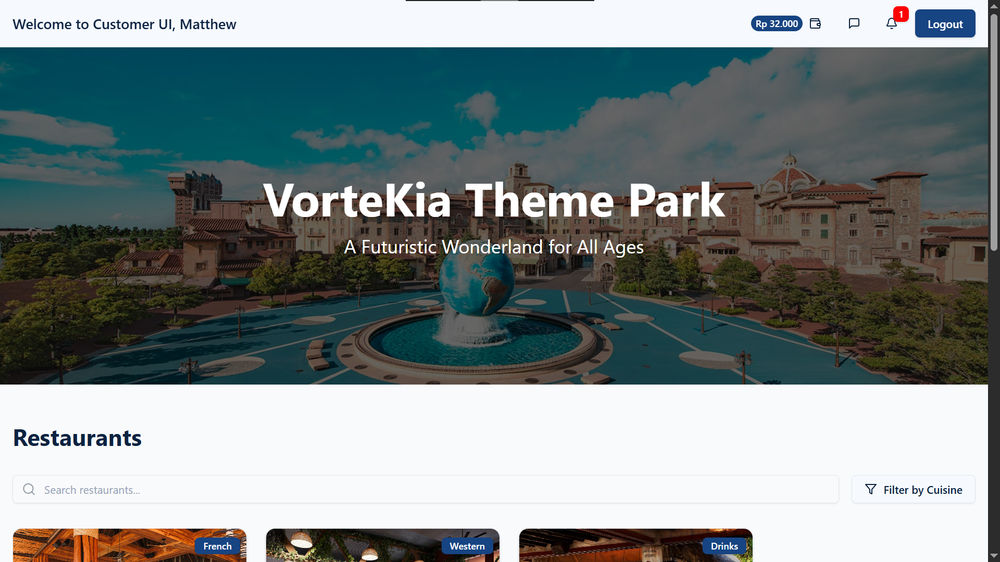

VorteKia is a theme park management desktop application built with Tauri (Rust) and React. This desktop application supports various tasks and needs of both customers and staff of the fictional VorteKia theme park. VorteKia features include being able to interact with the rides, restaurants, and stores in the theme park, while also providing necessary data management for the operations of multiple staff divisions, such as Customer Service, Maintenance, Marketing, Executive, and more.

This project was made to complete the Test Progressive Assistant (TPA) in the subject of Business Analysis and Application. It was yet another desktop app case similar to my (past) technical test project, [PHiscord](https://github.com/matthew-jl/PHiscord), so I was more comfortable in the [System Design and Architecture](#system-design--architecture) phase. For the development phase, I had to learn a new tech stack using Tauri and Rust, which deepened my backend knowledge. I was guided and tested by Jonathan Maverick, a lab assistant from BINUS Software Laboratory Center (SLC) and the casemaker of VorteKia. The desktop app took 4 weeks to develop and achieved a score of 88/100.

**Tech Stack:** Tauri (Rust), React (TypeScript), PostgreSQL, Redis, Cloudinary.

---
## Key Features

### Customer UI

VorteKia's Customer UI has a general page and specific pages for rides, restaurants, and stores at VorteKia. The Ride UI, Restaurant UI, and Store UI can be accessed when the customer is physically at the specific ride/restaurant/store.

**General Customer UI**

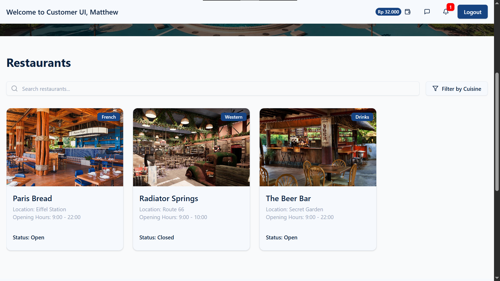

- **Browse Restaurants & Rides →** Search for restaurants, filter by cuisine, and view detailed menus with real-time "Open" or "Closed" status. See live ride queue counts and details to plan visits efficiently.
- **Top Up Virtual Balance →** Seamlessly add funds for in-park transactions.
- **Customer Service Chat →** Instantly contact Customer Service for assistance or inquiries through a dedicated chat interface.
- **Inactivity Timeout →** For security, customers are automatically logged out after 1 minute of inactivity.

**Ride UI**

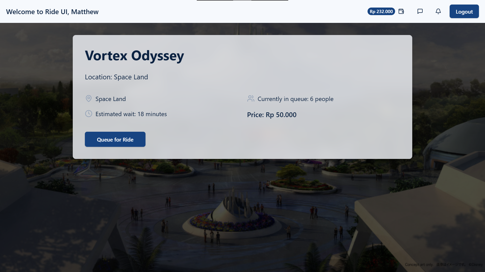

- **View Total Queued for Rides →** Customers can view the total queue count for the current ride.
- **Queue for a Ride →** Join the queue for a ride, deducting their virtual balance.

**Restaurant UI**

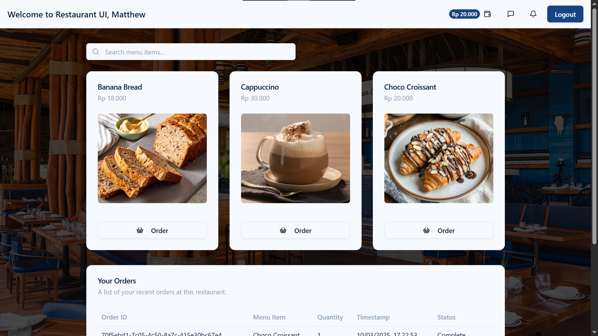

- **View and Search Menu →** Browse the available menu items and search for specific items.
- **Order Food →** Place orders directly from the menu and checkout for payment.

**Store UI**

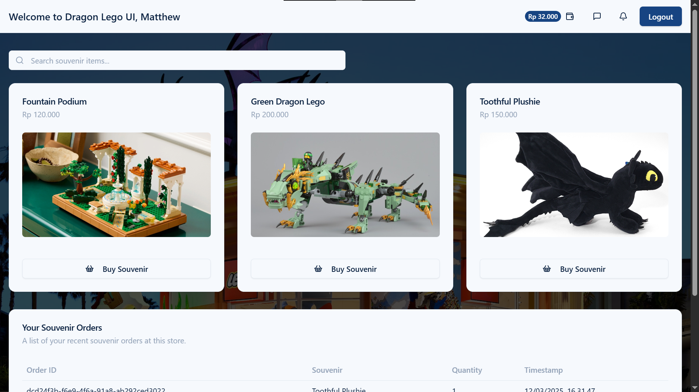

- **View Souvenirs →** Browse the list of souvenirs in the store.
- **Buy Souvenirs →** Place orders directly and proceed to checkout.

### Staff UI (Role-Based)

VorteKia's comprehensive Staff UI supports 16 staff roles across 6 divisions ([see use case diagram for details](./diagrams/MJ_VorteKia_UseCaseDiagram.png)). It achieves this through role-based access controls based on the staff's credentials.

**General Features**

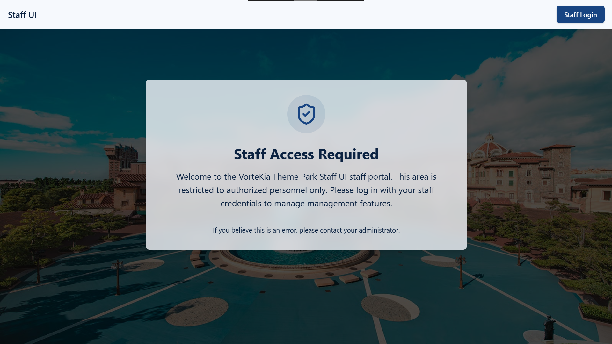
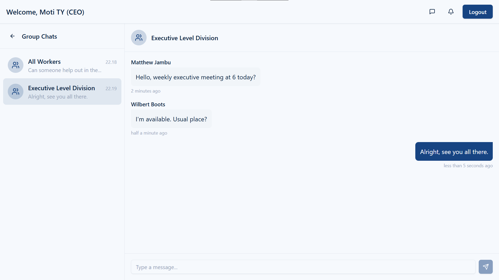

- **Secure Login →** Staff can log in using their credentials, with passwords hashed and salted for security.
- **Role-Based UI →** The UI dynamically adjusts to show features relevant to each staff member's role.
- **Group Chat Communication →** Staff can communicate with their respective divisions (e.g., Operational, Consumption, Maintenance) through dedicated group chats.

**Customer Service Division**

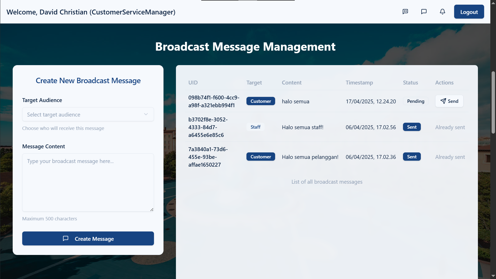

  - **Customer Service Chat →** Assist customers through an official shared account, viewable by all Customer Service staff.
  - **Broadcast Messaging →** The Customer Service Manager can send broadcast messages to all customers or staff.
  - **Customer Account Management →** Create new customer accounts with details like name and balance.
  - **Lost and Found Management →** Lost and Found Staff can log and update the status of lost and found items, with conditional data requirements based on item status.

**Operational Division**

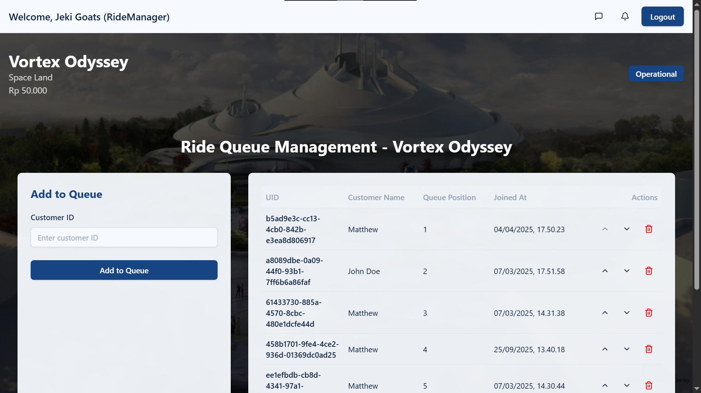

  - **Ride Management →** The Ride Manager can manage ride details, assign staff, and coordinate with the Maintenance Division.
  - **Ride Queue Management →** Ride Staff can view and manage ride queues, including adding or removing customers.

**Consumption Division**

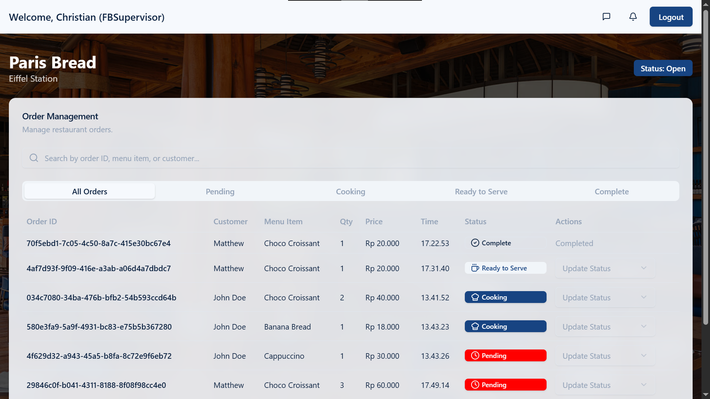

  - **Restaurant & Menu Management →** The F&B Supervisor can manage restaurant details, menu items, and staff assignments. A status filter allows viewing of "Open" or "Closed" restaurants.
  - **Order Processing →** Chefs and Waiters can view and update the status of food orders ("Pending", "Cooking", "Ready to Serve", "Complete").

**Care and Maintenance Division**

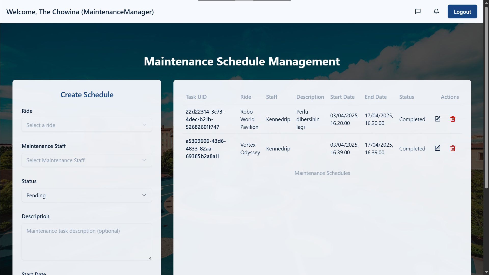

  - **Maintenance Scheduling →** The Maintenance Manager can create, update, and delete maintenance schedules, assigning tasks to Maintenance Staff.
  - **Task Management →** The handler ensures that a Maintenance Staff member can only be assigned to one active task at a time.
  - **View-Only Access →** Maintenance Staff can only view their assigned tasks, without the ability to create or edit schedules.

**Marketing Division**

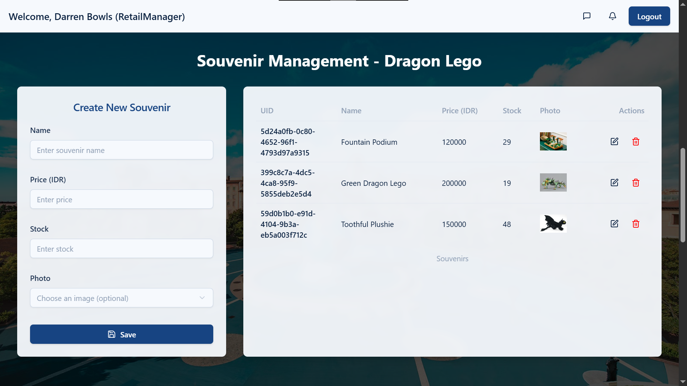

  - **Store & Souvenir Management →** The Retail Manager can manage store details and add, update, or remove souvenirs.
  - **View-Only Access →** Sales Associates can only view store details, without the ability to edit.

**Executive Division**

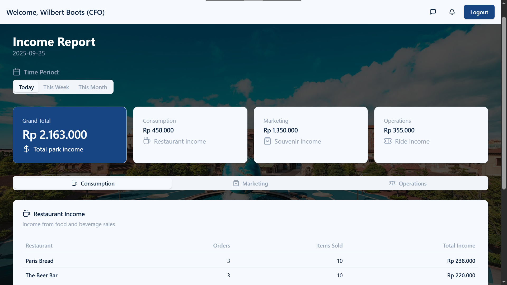

  - **Comprehensive Oversight →** The CEO, CFO, and COO have broad access to manage various aspects of the park, including staff accounts, ride and restaurant management, and financial reporting.
  - **Income Reports →** The CFO and other executives can view detailed income reports, filterable by day, week, or month, covering all revenue streams.

---
## System Design & Architecture

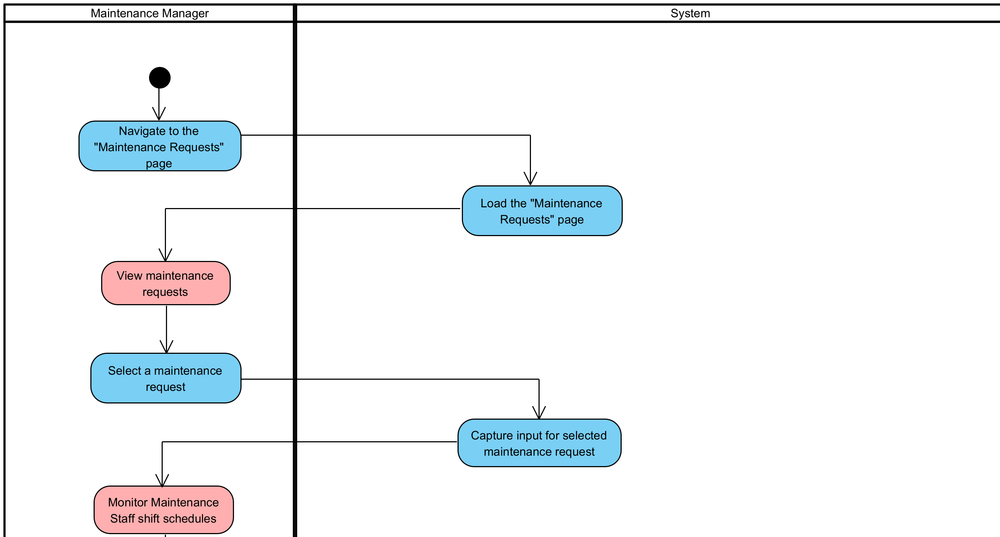
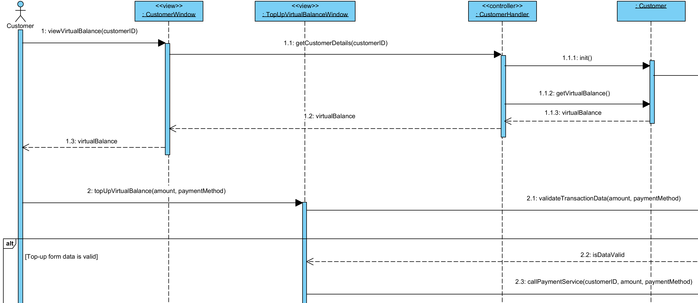
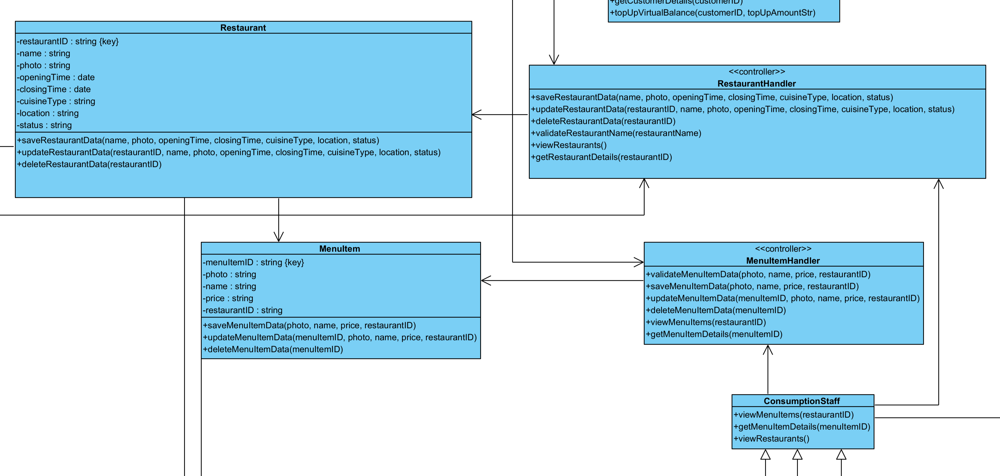

VorteKia provides a handful of features for each role in the theme park. With 17 total user roles, the system design diagrams are complex and packed at the same time. As such, I admit that a few diagrams (especially use case and class diagrams) require a bit of effort to read and fully understand. However, all the diagrams served to be very useful as guidance in developing the desktop app. Here are the outputs of the system design phase that was done before development.

- **System Design Diagrams →** Detailed diagrams illustrating the system's architecture and user flows were created using the Satzinger concept during the planning phase. These can be found here:
  - [All Diagrams (Folder)](./diagrams/)
  - [View Use Case Diagram](./diagrams/MJ_VorteKia_UseCaseDiagram.png)
  - [Download Use Case Descriptions (Excel Workbook)](./diagrams/MJ_VorteKia_UseCaseDescriptions.xlsx)
  - [View Activity Diagram Example](./diagrams/MJ_VorteKia_ActivityDiagram_AddMenuItems.png)
  - [View Sequence Diagram Example](./diagrams/MJ_VorteKia_SequenceDiagram_AddMenuItems.png)
  - [View Class Diagram](./diagrams/MJ_VorteKia_ClassDiagram.png)
- **Database Design →** The application utilizes PostgreSQL as its primary database. The SQL query to restore the database with its schema can be accessed here:
  - [Create + Insert SQL for Database](https://binusianorg-my.sharepoint.com/personal/matthew_lim002_binus_ac_id/_layouts/15/guestaccess.aspx?share=EfQineHtvhRFh0K2g7a4P7QBD29Cjhvt0FiaPUbvkc5Uvw&e=KvZMKb)

> 
